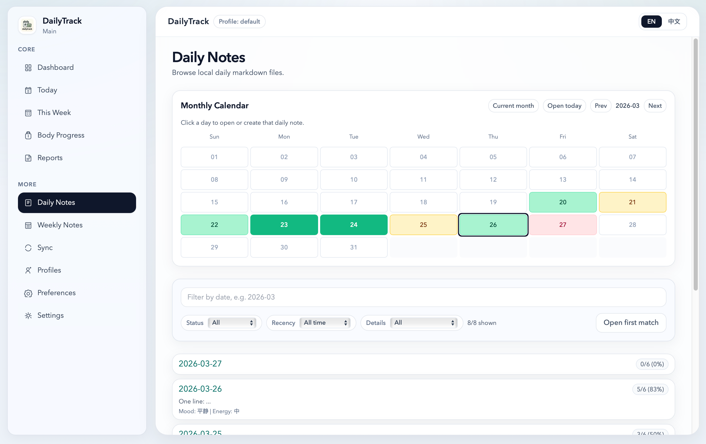
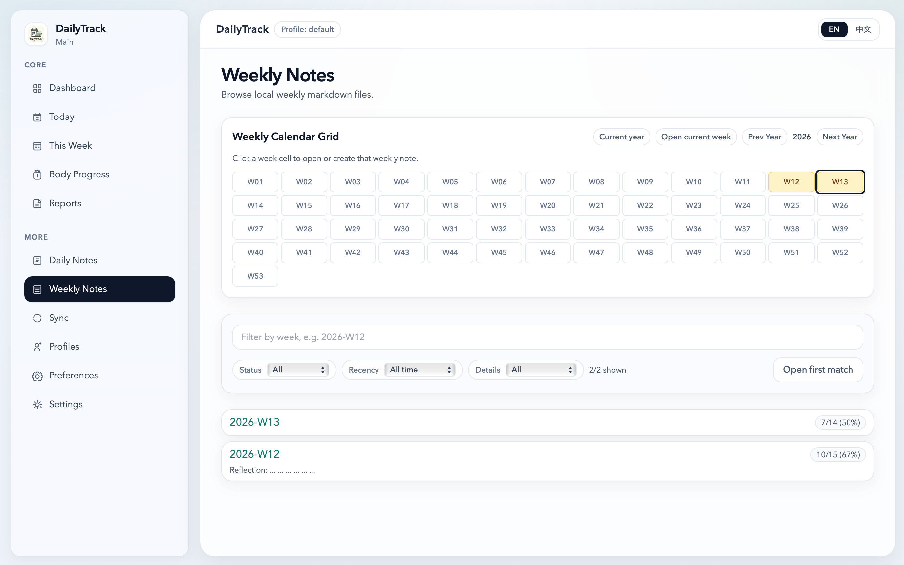
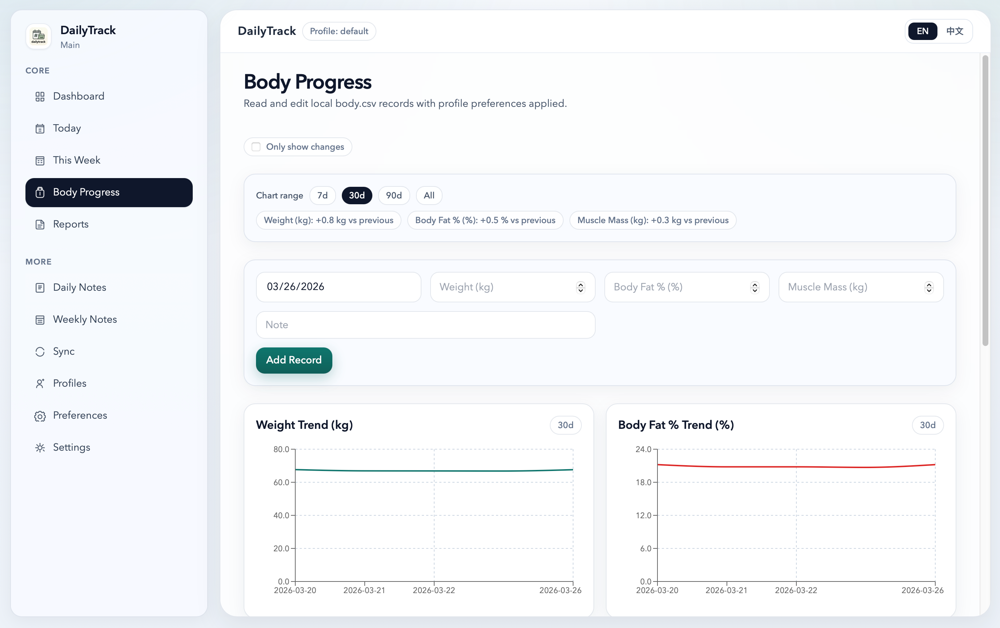

# dailytrack

[](https://github.com/Routhleck/dailytrack/releases/latest)
[](./LICENSE)


[](https://buymeacoffee.com/forrestcai6)

Local-first life tracker for Markdown and CSV users.

- Project homepage (EN/中文): https://routhleck.github.io/dailytrack/
- Latest release: https://github.com/Routhleck/dailytrack/releases/latest
- Full roadmap: [docs/ROADMAP.md](./docs/ROADMAP.md)

## For Users

### What It Is

`dailytrack` is a Tauri app that reads and writes local files directly. Your notes and records stay in Markdown/CSV on disk.

- No account system
- No required cloud backend
- Structured editing + raw markdown fallback
- Multi-profile workflows with per-profile templates and preferences

### Feature Highlights

- Dashboard with today/week progress, reminders, and completion heatmap
- Daily/Weekly note editing with autosave and template-delta focus mode
- Weekly history calendar now supports `By month` / `By year` views for lower-density browsing on mobile screens
- Body tracking via local `body.csv` with chart + trend support
- Android `Settings -> App Updates` can check GitHub latest release and open the matching APK download link
- Memory-first runtime cache + idle write-behind sync for smoother editing on larger datasets
- Startup progress gate with staged loading feedback before entering the workspace
- WebDAV snapshots + realtime sync (optional)
- Conflict resolution tools and diagnostics export

### Screenshots

<p align="center">
  
  
  
  
  
  
  
</p>

### Download And Install

Pick your installer from the latest release page:

- macOS (Apple Silicon): `dailytrack_*_aarch64.dmg`
- macOS (Intel): `dailytrack_*_x64.dmg`
- Windows: `dailytrack_*_x64_en-US.msi` or `dailytrack_*_x64-setup.exe`
- Linux: `dailytrack_*_amd64.AppImage` and `dailytrack_*_amd64.deb`
- Android: `dailytrack_*_android_*.apk` (usually `*_android_universal-release.apk`)

Linux note:
- AppImage is self-contained and usually much larger than `.deb`.
- If you prioritize smaller download size on Debian/Ubuntu-based systems, prefer the `.deb` package.

Install/trust policy docs:

- [docs/DISTRIBUTION_POLICY.md](./docs/DISTRIBUTION_POLICY.md)
- [docs/TROUBLESHOOTING.md](./docs/TROUBLESHOOTING.md)

### Data Ownership

Default base root:

- macOS/Linux: `~/dailytrack-data`
- Windows: `%USERPROFILE%\\dailytrack-data`

Profile layout:

```text
dailytrack-data/
  profiles/
    default/
      daily/
      weekly/
      body.csv
      templates/
        daily.md
        weekly.md
      preferences.json
```

Markdown/CSV files remain the source of truth.

## For Developers

### Tech Stack

- Tauri
- React + TypeScript
- Tailwind CSS

### Local Setup

```bash
npm install
npm run tauri:dev
```

Quality gates:

```bash
npm run lint
npm run test -- --run
npm run build
cargo check --manifest-path src-tauri/Cargo.toml
```

### Release Workflow (Maintainers)

- Release pipeline: `.github/workflows/publish.yml`
- Android APK pipeline: `.github/workflows/android-apk.yml`
- Before tagging, move user-visible items from `Unreleased` to `## [x.y.z] - YYYY-MM-DD` in `CHANGELOG.md`

Tag release:

```bash
git tag vX.Y.Z
git push origin master --tags
```

Generate readable notes draft:

```bash
skills/dailytrack-release/scripts/make_release_notes.sh vA.B.C vX.Y.Z > /tmp/dailytrack-notes.md
gh release edit vX.Y.Z --notes-file /tmp/dailytrack-notes.md
```

### Project Docs

- [AGENTS.md](./AGENTS.md)
- [docs/ARCHITECTURE.md](./docs/ARCHITECTURE.md)
- [docs/DATA_MODEL.md](./docs/DATA_MODEL.md)
- [docs/PARSER_SPEC.md](./docs/PARSER_SPEC.md)
- [docs/FS_STORAGE.md](./docs/FS_STORAGE.md)
- [docs/PREFERENCES_SCHEMA.md](./docs/PREFERENCES_SCHEMA.md)
- [docs/QA_CHECKLIST.md](./docs/QA_CHECKLIST.md)
- [docs/RELEASE_CHECKLIST.md](./docs/RELEASE_CHECKLIST.md)
- [docs/DISTRIBUTION_POLICY.md](./docs/DISTRIBUTION_POLICY.md)
- [docs/TROUBLESHOOTING.md](./docs/TROUBLESHOOTING.md)
- [docs/TUTORIALS.md](./docs/TUTORIALS.md)
- [docs/ROADMAP.md](./docs/ROADMAP.md)

### Milestones (v1.0+)

Detailed backlog: [docs/ROADMAP.md](./docs/ROADMAP.md)

- `v1.0.0`: reliability and trust
- `v1.1.0`: search and navigation power
- `v1.2.0`: data safety and history
- `v1.3.0`: analytics and insights
- `v2.0.0`: extensibility and custom tracking
