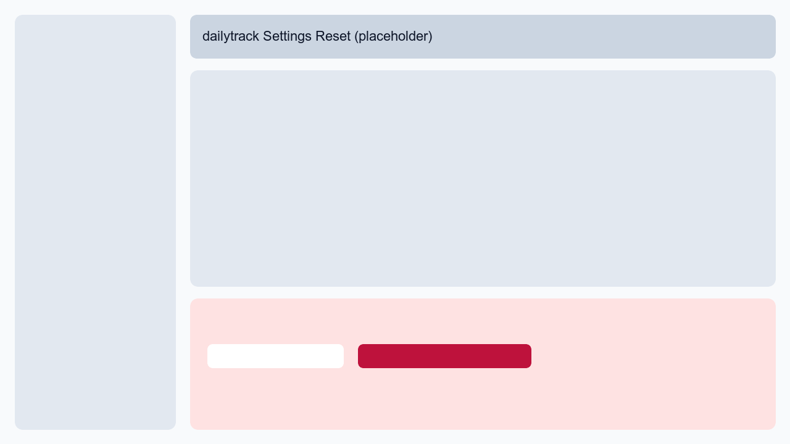

# dailytrack

Local-first desktop life tracker for Markdown users.

`dailytrack` is a Tauri desktop app that reads and writes your local tracker files.
Markdown and CSV stay as the only source of truth.

## Screenshots

> Replace these PNG placeholders with real screenshots later, while keeping file names.




## Why dailytrack

- Local-first and private: no cloud, no account, no remote API.
- Markdown-first: app is an editor/viewer layer, not a hidden database.
- Structured plus raw: toggle checklists in UI or edit raw Markdown directly.
- Profile-based workflow: separate personal/work templates and preferences.
- Real-time feel: debounced autosave with live refresh from disk.

## What It Is

- Desktop app for daily notes, weekly reviews, and body progress.
- Local file parser/editor for known Markdown schema.
- Practical personal tool with minimal complexity.

## What It Is Not

- SaaS or team collaboration product.
- Cloud sync platform.
- Database-backed note system.

## Tech Stack

- Tauri
- React
- TypeScript
- Tailwind CSS
- Recharts

## Quick Start

### Prerequisites

- Node.js LTS
- Rust toolchain
- Tauri platform prerequisites

### Run in dev

```bash
npm install
npm run tauri:dev
```

### Checks

```bash
npm run lint
npm run test
npm run build
```

### Build desktop bundle

```bash
npm run tauri:build
```

## Data Ownership and Storage

Default base data root:

- macOS/Linux: `~/dailytrack-data`
- Windows: `%USERPROFILE%\\dailytrack-data`
- Legacy fallback: if `~/life-tracker-data` exists and `dailytrack-data` does not, app uses legacy path.

Profile layout:

```text
dailytrack-data/
  profiles/
    default/
      daily/
      weekly/
      body.csv
      templates/
        daily.md
        weekly.md
      preferences.json
```

## Core Features

- Dashboard summary for today, this week, body, and recent notes.
- Daily note page:
  - structured checklist editing
  - raw Markdown mode
  - pure autosave mode
- Weekly note page:
  - section checklists
  - reflection fields
  - raw Markdown mode
  - pure autosave mode
- Body progress page:
  - local `body.csv` table + form
  - weight/waist trend charts
- Profiles:
  - create/switch/delete profile
  - editable template presets
- Preferences:
  - per-profile module toggles
- Settings:
  - root switch
  - one-click root migration
  - export/import data bundle
  - tutorial replay
  - reset to first-run state (danger zone)

## Onboarding and Tutorial

- First launch in an empty root opens template setup modal.
- Template presets support English and Chinese variants.
- After initial template setup, a 5-step guide starts once.
- You can replay tutorial in `Settings -> Start Tutorial`.

## Save and Sync Behavior

- Daily/Weekly use debounced autosave only (no manual save button).
- Body records save on submit/delete.
- App polls disk and refreshes pages when local draft is clean.

## Portability

- Export creates `dailytrack-export-<timestamp>` folder.
- Import merges/copies files into current active profile root.
- Data root migration copies whole root and switches app root.

## GitHub Release CI

- Workflow: `.github/workflows/publish.yml`
- Targets:
  - windows-latest
  - macOS aarch64
  - macOS x86_64
- Trigger:
  - push tag like `v0.2.0`
  - or manual `workflow_dispatch`

Example:

```bash
git tag v0.2.0
git push origin v0.2.0
```

## Markdown Schema

Daily note (`daily/YYYY-MM-DD.md`):

```md
# 2026-03-18

## Daily Core
- [ ] ...

## Optional
- [ ] ...

## One Line
-
```

Weekly note (`weekly/YYYY-Www.md`):

```md
# 2026-W12

## Body
- [ ] ...

## Research
- [ ] ...

## Life
- [ ] ...

## Output
- [ ] ...

## Social
- [ ] ...

## Reflection
### 3 good things this week
1.
2.
3.

### 3 most important things next week
1.
2.
3.
```

Body CSV (`body.csv`):

```csv
date,weight,waist,note
2026-03-18,71.2,82.0,steady
```

## Limitations

- Structured save is schema-aware and normalizes formatting.
- Unknown custom Markdown blocks may not be preserved in structured mode.
- Import is file-level merge/overwrite without semantic conflict resolution.
- No file locking.

## Project Docs

- [AGENTS.md](./AGENTS.md)
- [docs/ARCHITECTURE.md](./docs/ARCHITECTURE.md)
- [docs/DATA_MODEL.md](./docs/DATA_MODEL.md)
- [docs/PARSER_SPEC.md](./docs/PARSER_SPEC.md)
- [docs/FS_STORAGE.md](./docs/FS_STORAGE.md)
- [docs/QA_CHECKLIST.md](./docs/QA_CHECKLIST.md)
- [docs/RELEASE_CHECKLIST.md](./docs/RELEASE_CHECKLIST.md)
