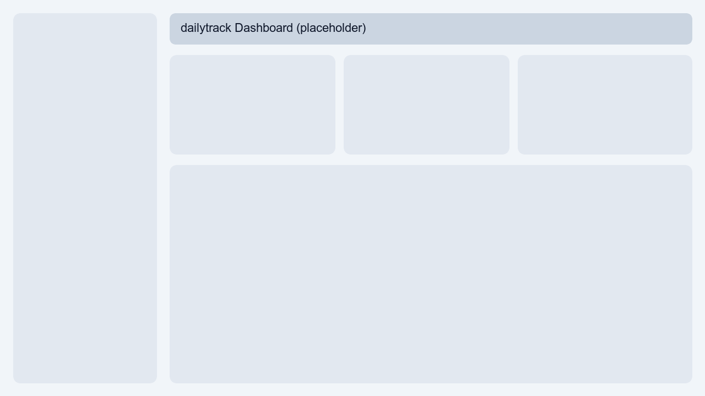
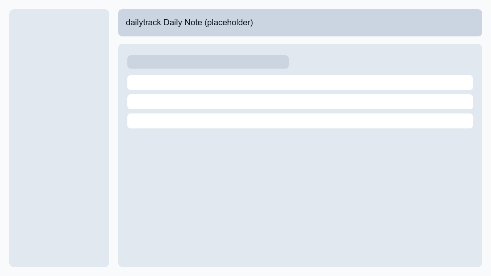
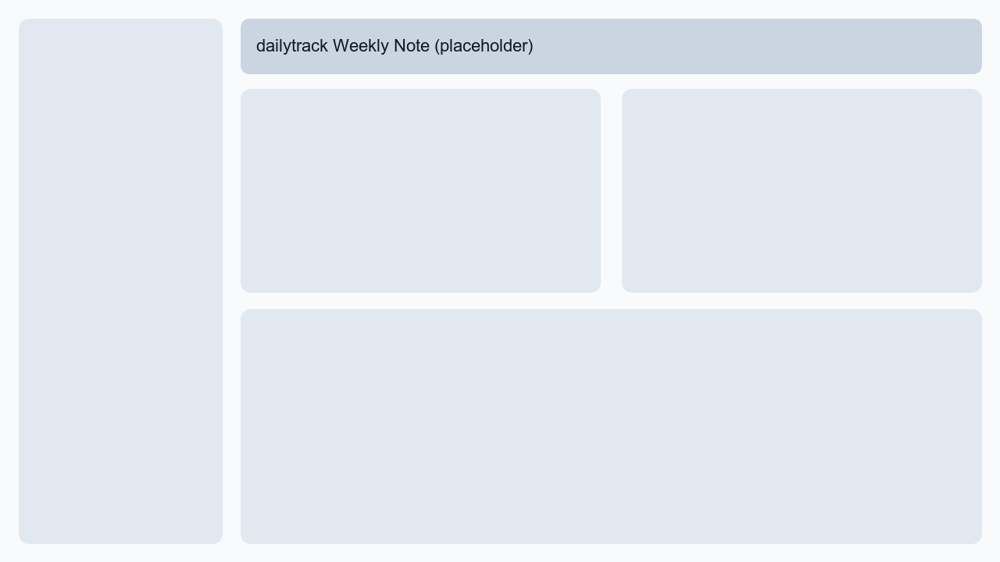
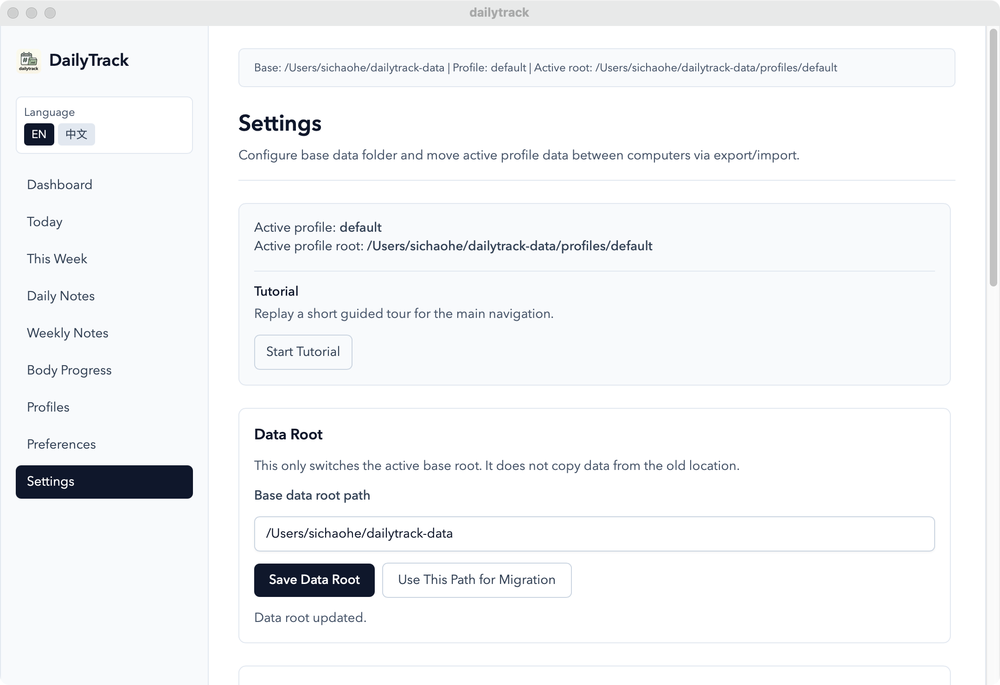

# dailytrack

[](https://buymeacoffee.com/forrestcai6)

Local-first desktop life tracker for Markdown users.

`dailytrack` is a Tauri desktop app that reads and writes your local tracker files.
Markdown and CSV remain the only source of truth.

## Start Here

### I just want to use it (Download)

- Latest release: https://github.com/Routhleck/dailytrack/releases/latest
- All releases: https://github.com/Routhleck/dailytrack/releases

Pick the installer by platform:

- macOS (Apple Silicon): `dailytrack_*_aarch64.dmg`
- macOS (Intel): `dailytrack_*_x64.dmg`
- Windows: `dailytrack_*_x64_en-US.msi` or `dailytrack_*_x64-setup.exe`

Install in 3 steps:

1. Open the latest release page.
2. Download the matching installer.
3. Install and launch `dailytrack`.

### I want to develop locally

```bash
npm install
npm run tauri:dev
```

Quality gates:

```bash
npm run lint
npm run test -- --run
npm run build
cargo check --manifest-path src-tauri/Cargo.toml
```

## Why dailytrack

- Local-first and private: no account system, no forced cloud backend.
- Markdown-first: app is an editor/viewer layer, not a hidden database.
- Structured + raw editing: fast checkbox toggles with raw markdown fallback.
- Profile workflow: multiple profiles with separate templates and preferences.
- Real-time feel: autosave + local file change refresh.
- Adaptive shell: desktop sidebar + mobile bottom navigation.
- Mobile quick menu for secondary routes (`Dashboard`, `Profiles`, `Settings`, etc.) on narrow screens.

## Screenshots

<p align="center">
  
  
  
  
</p>

## Core Features

- Dashboard:
  - Today and This Week progress summary
  - latest body metrics snapshot
  - recent files list
- Daily note:
  - structured checklist editing
  - one-line editing
  - raw markdown mode
  - debounced autosave (no manual save button)
- Weekly note:
  - section checklist editing
  - reflection field editing
  - raw markdown mode
  - debounced autosave
- Body progress:
  - local `body.csv` table + record form
  - metric toggles by preferences
  - per-metric unit/decimal display config
  - trend charts
- Profiles:
  - create/switch/delete profiles
  - built-in template presets
  - current template editing (structured by default, raw mode available)
  - one-click apply template to today/this week (overwrite)
- Preferences:
  - per-profile tracking toggles (daily/weekly/body)
  - sync mode (`watch` / `poll`)
- Settings:
  - data root migration (copy + switch)
  - export/import
  - WebDAV snapshot backup controls
  - updater controls (auto-check, manual check, install+restart)
  - tutorial replay
  - full reset to first-run state
- Sync:
  - WebDAV realtime file sync status
  - push/pull/both actions
  - unresolved conflict list + resolve actions
  - local/remote text preview for conflict inspection

## Data Ownership and Storage

Default base root:

- macOS/Linux: `~/dailytrack-data`
- Windows: `%USERPROFILE%\\dailytrack-data`
- Legacy fallback: if `~/life-tracker-data` exists and `dailytrack-data` does not, app uses legacy path.

Profile layout:

```text
dailytrack-data/
  profiles/
    default/
      daily/
      weekly/
      body.csv
      templates/
        daily.md
        weekly.md
      preferences.json
```

Important rules:

- Markdown and CSV are the source of truth.
- The app reads, parses, and writes local files.
- Structured mode may normalize formatting to the supported schema.

## File Formats

Daily note (`daily/YYYY-MM-DD.md`):

```md
# 2026-03-18

## Daily Core
- [ ] ...

## Optional
- [ ] ...

## One Line
-
```

Weekly note (`weekly/YYYY-Www.md`):

```md
# 2026-W12

## Body
- [ ] ...

## Research
- [ ] ...

## Life
- [ ] ...

## Output
- [ ] ...

## Social
- [ ] ...

## Reflection
### 3 good things this week
1.
2.
3.

### 3 most important things next week
1.
2.
3.
```

Body CSV (`body.csv`):

```csv
date,weight,waist,bodyFat,muscleMass,chest,hip,note
2026-03-18,71.2,82.0,14.8,33.5,97.0,98.2,steady
```

## Sync, Backup, and Portability

- Local sync:
  - `Watch` mode (recommended): Rust watcher emits file-change events
  - `Poll` mode: periodic fallback checks
- Import/Export/Migration:
  - export creates `dailytrack-export-<timestamp>` folder
  - import merges files into active profile root
  - migration copies whole base root and switches app root
  - operation summary includes copied/overwritten/skipped/new-dir counts
- WebDAV snapshots (optional):
  - `Push Now`, `Pull Latest`, `Pull Selected`, snapshot list/delete
  - optional interval realtime sync bridge
  - remote `meta.json` + `snapshots/*.zip`
  - optional local backup before pull overwrite
- WebDAV realtime file sync (optional):
  - Sync page: `Sync Both`, `Push Only`, `Pull Only`
  - automatic periodic background sync (when WebDAV enabled)
  - remote manifest + per-file transport:
    - `realtime/manifest.json`
    - `realtime/files/...`
  - conflict strategy: keep both and resolve manually
  - conflict copies stored under active profile root:
    - `conflicts/*.conflict-<timestamp>-<device>`

## Onboarding

- First launch with empty root opens template setup.
- Template presets support English and Chinese variants.
- A guided tutorial runs after first setup and can be replayed in Settings.

## macOS Install Notice (Unsigned Builds)

If a release build is unsigned/notarized, macOS Gatekeeper may show:

`"dailytrack" is damaged and can’t be opened.`

You can use one of these workarounds:

- Run helper script from DMG: `fix-dailytrack-quarantine.command`
- Or run manually:

```bash
xattr -dr com.apple.quarantine /Applications/dailytrack.app
```

For production/public distribution, signed + notarized artifacts are recommended.

## Limitations

- Structured save is schema-aware and can normalize markdown formatting.
- Unknown custom markdown blocks may not be preserved in structured mode.
- Import is file-level merge/overwrite; no semantic conflict resolution yet.
- No cross-process file locking.

## Maintainer Release Workflow

Release CI workflow: `.github/workflows/publish.yml`
Android APK workflow: `.github/workflows/android-apk.yml`

Targets:

- windows-latest
- macOS aarch64
- macOS x86_64

`publish` speed notes:
- frontend lint/test/build now runs once in a dedicated `verify-frontend` job
- prebuilt `dist/` is uploaded as artifact and reused by matrix packaging jobs
- matrix jobs skip repeated frontend rebuild via `src-tauri/tauri.ci.conf.json`

Trigger release build by tag:

```bash
git tag v0.3.2
git push origin master --tags
```

Generate readable release notes draft:

```bash
skills/dailytrack-release/scripts/make_release_notes.sh v0.3.1 v0.3.2 > /tmp/dailytrack-v0.3.2-notes.md
gh release edit v0.3.2 --notes-file /tmp/dailytrack-v0.3.2-notes.md
```

Build Android APKs:

- Run workflow `android-apk` from Actions page (artifact build, optional release upload).
- On tag push (`v*`), workflow also runs automatically and uploads APK artifacts.
- Speed profile:
  - default debug build uses `aarch64` target only (faster, good for most physical-device testing)
  - workflow-dispatch `release` build uses `aarch64 + x86_64`
  - Rust + Gradle caches are enabled in the APK workflow

Local build speed helpers:

```bash
# frontend only
npm run build:frontend

# desktop rust compile only (skip dmg/msi bundling for faster iteration)
npm run build:desktop:fast
```

Useful docs:

- `skills/dailytrack-release/SKILL.md`
- `docs/RELEASE_CHECKLIST.md`

## Project Docs

- [AGENTS.md](./AGENTS.md)
- [docs/ARCHITECTURE.md](./docs/ARCHITECTURE.md)
- [docs/DATA_MODEL.md](./docs/DATA_MODEL.md)
- [docs/PARSER_SPEC.md](./docs/PARSER_SPEC.md)
- [docs/FS_STORAGE.md](./docs/FS_STORAGE.md)
- [docs/PREFERENCES_SCHEMA.md](./docs/PREFERENCES_SCHEMA.md)
- [docs/QA_CHECKLIST.md](./docs/QA_CHECKLIST.md)
- [docs/RELEASE_CHECKLIST.md](./docs/RELEASE_CHECKLIST.md)

## Future Roadmap

- Better import overwrite preview before confirm.
- Native folder picker for all root/import/export/migration paths.
- Optional history snapshots for safer rollback.
- More built-in template packs and community-contributed templates.
- Optional mobile app client aligned with existing WebDAV realtime sync protocol.
